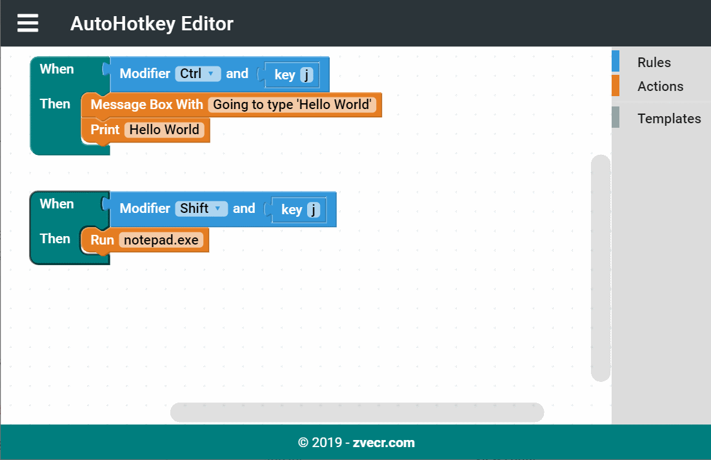

# vue-ahk
> Online Drag-and-Drop editor for AutoHotkey scripts

[](https://travis-ci.org/zvecr/vue-ahk)
[](https://app.codacy.com/app/zvecr/vue-ahk?utm_source=github.com&utm_medium=referral&utm_content=zvecr/vue-ahk&utm_campaign=Badge_Grade_Dashboard)
[](https://dependabot.com)

Drag-and-Drop Blockly based editor for creating simple AutoHotkey scripts.



## Development
For convenience a `.nvmrc` file has been provided at the root of the project directory.

### Project setup
```bash
npm install
```

### Compiles and hot-reloads for development
```bash
npm run serve
```

### Compiles and minifies for production
```bash
npm run build
```

### Run your tests
```bash
npm run test
```

### Lints and fixes files
```bash
npm run lint
```
